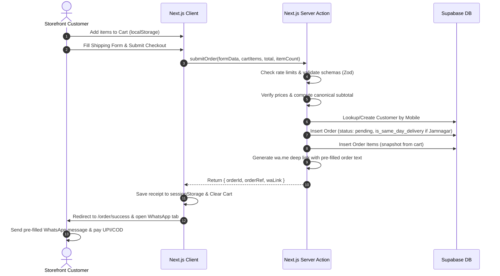
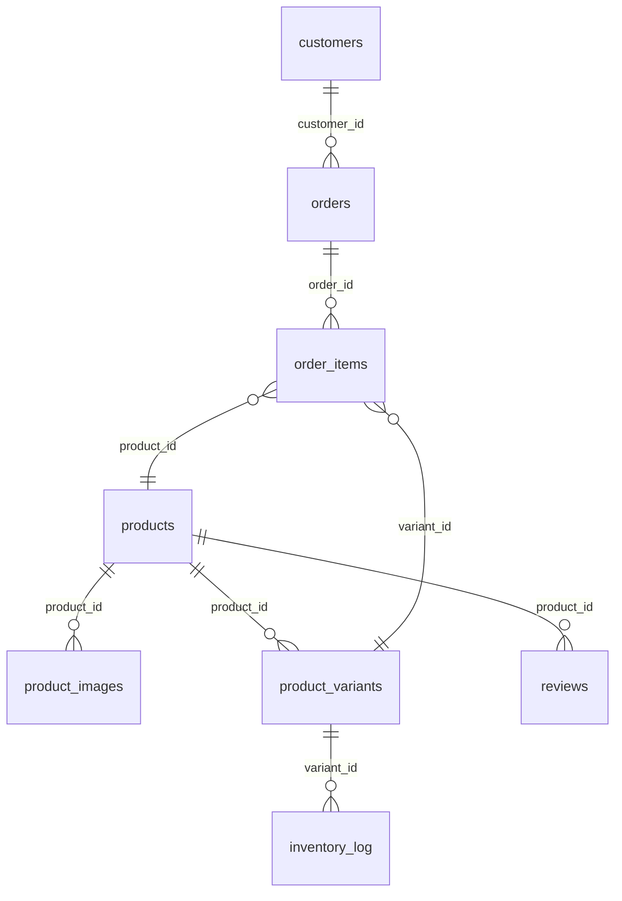

# ONYX — PROJECT CONTEXT
### Complete AI Briefing & End-to-End System Document · Do Not Deploy

---

## HOW TO USE THIS FILE

Paste this entire file at the start of any AI conversation, or attach it as a document.
This file provides complete, deep technical and structural context for the Onyx project to prevent any hallucinations, incorrect assumptions, or violations of permanent architecture decisions.

This file covers:
- Core business model, Indian market target, and WhatsApp-commerce workflow.
- Complete tech stack versions and custom configurations.
- Design system colors, typography, glassmorphism specs, and shape rules.
- Rendering patterns, client routing, and the three-layer Supabase client trust system.
- Database DDL schema, triggers, RLS policies, and rate-limiting structures.
- All customer and admin routes, synonym tag taxonomies, and synomym-based search.
- Step-by-step technical flows for order checkout, customer lookup, and stock adjustments.
- Known gaps, non-standard patterns, and permanent system constraints.
- Detailed page-by-page architecture, processes, and functionalities.

---

## PART 1: BUSINESS IDENTITY & WORKFLOWS

**Brand:** Onyx — D2C Indian menswear e-commerce brand. Premium minimalist street aesthetic.
**Market:** India. Men's clothing. Urban Indian customer.
**Stage:** Deployed and live on Vercel: https://onyxmens.vercel.app/
**Operator:** Solo founder. Handles all technical decisions personally.

### WhatsApp-Commerce Business Model
Onyx operates on a WhatsApp-commerce model. There is **no payment gateway integration** and **no customer account registration**. These are permanent architectural decisions, not missing features. The checkout flow operates as follows:



1. **Cart Building:** The customer selects clothing variants (size/color) on the storefront and saves them in their local cart (using `localStorage` key `onyx_cart`).
2. **Order Submission:** The customer fills in the checkout form (Full Name, Indian Mobile Number, Email, Address, City, State, Pincode, Notes, and Payment Method Selection: Prepaid UPI or Cash on Delivery).
3. **Server Processing (`submitOrder` Server Action):**
   - Resolves rate limits via `lib/rate-limit.ts` (5 order submissions per IP per hour).
   - Validates inputs using `checkoutFormSchema` (or `checkoutSavedAddressSchema` if customer uses saved address).
   - Fetches product variants from database and verifies that client prices match base price. Recomputes canonical subtotal.
   - Inserts or fetches the customer record inside `customers` table by their mobile number.
   - Inserts a new order record into `orders` (status defaults to `pending`).
   - Inserts order items into `order_items` as a snapshot of products/variants.
   - Generates a pre-filled WhatsApp message containing the order details.
4. **WhatsApp Handshake:** The server returns the `waLink` and `orderRef`. The client saves the order receipt in `sessionStorage` (under key `onyx_receipt`), clears `localStorage` cart, opens the WhatsApp link in a new browser tab, and redirects the storefront to `/order/success?ref=ONX-...`.
5. **Fulfillment:** The customer taps "Send" in WhatsApp. Payments are completed manually inside the WhatsApp conversation via UPI QR codes or confirmed for Cash on Delivery. Staff updates the order status in the admin panel to trigger stock decrements.

---

## PART 2: TECH STACK

| Layer | Technology | Notes |
|---|---|---|
| **Framework** | Next.js 16.2.6 | App Router only. No Pages Router. |
| **Language** | TypeScript 5.7 | `ignoreBuildErrors: false` — invalid builds are blocked. |
| **React** | React 19 | Server Components (RSC) + Client Components. |
| **Styling** | Tailwind CSS v4 | PostCSS compiler `@tailwindcss/postcss`. No utility UI libraries (no shadcn). |
| **Animation** | Framer Motion v12 | JS animations only. CSS animations via `tw-animate-css`. |
| **Icons** | Lucide React | Used for UI icons (cart, search, package, arrows, trash). |
| **Fonts** | Bebas Neue + Inter | Loaded via `next/font`. Bebas Neue = Headings. Inter = Body/UI. |
| **Database** | Supabase Postgres | 11 tables. Row Level Security (RLS) active on all. |
| **Auth** | Supabase Auth | Staff accounts only. No customer auth. |
| **Storage** | Supabase Storage | Bucket: `product-images`. For product cover and gallery uploads. |
| **Hosting** | Vercel | Free tier. `images.unoptimized: true` configured in next.config.mjs. |
| **Package Manager** | npm | `package-lock.json` is the active lockfile. |
| **Middleware** | `proxy.ts` | Next.js 16 root-level middleware pattern (not `middleware.ts`). |

### Build Commands
```bash
npm install
npm run dev       # Starts dev server: next dev --hostname 0.0.0.0 --webpack
npm run build     # Compiles production bundle: next build
npm run start     # Starts production server: next start --hostname 0.0.0.0
npm run lint      # Runs ESLint: eslint .
```

### Environment Variables
- `NEXT_PUBLIC_SUPABASE_URL`: Supabase project URL.
- `NEXT_PUBLIC_SUPABASE_ANON_KEY`: Supabase client-side anonymous key.
- `SUPABASE_SERVICE_ROLE_KEY`: Elevated key that bypasses RLS (Server-only).
- `CRON_SECRET`: Bearer token authorization header for daily expire-orders cron.
- `NEXT_PUBLIC_WHATSAPP_NUMBER`: Business contact number (Fallback: `919714367460`).

---

## PART 3: DESIGN SYSTEM SPECIFICATIONS

All styling is built upon a strict, premium street aesthetic.

### Shape System: Zero Rounded Corners
```css
/* Global override in app/globals.css */
* { border-radius: 0 !important; }
```
There are **never** rounded corners in the Onyx UI. No exceptions. Cards, buttons, text inputs, images, color pills, and status badges must all have sharp, 90-degree edges.

### Color Palette
- **Background:** `#000000` (Pure Black). Global storefront background.
- **Primary Text:** `#ffffff` (Pure White). Headings, body copy, icons.
- **Borders:** `border-white/10` (10% White). Divider lines, form inputs, grids.
- **Accent Borders:** `border-white/5` (5% White). Subtle separation dividers.
- **Status: Live / Success:** Green.
- **Status: Draft / Warning:** Amber / Yellow.
- **Status: Out of Stock (OOS) / Alert:** Red.

### Typography Rules
- **Bebas Neue:** Used exclusively for display headings, hero banners, section titles, and uppercase product names.
- **Inter:** Used for all body text, paragraphs, buttons, input fields, pricing text, and metadata.
- **Rule:** Never use Bebas Neue for functional UI controls (buttons, forms, tables) or detailed body descriptions.

### Glassmorphism Specification
Used for text cards, hero call-to-actions, and UI overlays on top of dynamic backgrounds:
```css
bg-white/[0.03]
border border-white/10
backdrop-blur-md /* or backdrop-blur-lg */
```

### Video Blending Constraint
The About section background video uses `mix-blend-screen` overlay styling. This keys out black backgrounds, causing white assets/clothing to float over the pure black site background.

---

## PART 4: ARCHITECTURE & TRUST PATTERNS

### Rendering Patterns
- **Storefront Listings:** RSC fetches initial data, passes it to Client components. Cache `revalidate = 60` for caching listings.
- **Storefront Checkout/Cart/Status:** Client-only rendering. Reads localStorage/sessionStorage. Fetches tracking details via API.
- **Admin Dashboard & Management:** RSC fetches data, renders lists. Mutations handle via Server Actions.

### The Three-Layer Supabase Client System
To maintain strict data integrity, Onyx divides database operations across three distinct clients with different trust levels:

1. **Browser Client (`lib/supabase/client.ts`):** Uses anonymous key. Strictly gated by Row Level Security (RLS). Used for client-side fetching (e.g. reviews approved, stock checks).
2. **Server Client (`lib/supabase/server.ts`):** Uses cookies and anonymous key. Restricts reads to storefront guidelines. Used inside Server Components and Customer Server Actions. Includes `validateRole()` to verify staff credentials.
3. **Admin Client (`lib/supabase/admin.ts`):** Uses service-role key. Bypasses RLS. Strictly server-only. Used for cron actions, guest phone checks, and admin dashboard updates.

---

## PART 5: DATABASE — COMPLETE SCHEMA

PostgreSQL database on Supabase. RLS enabled on all 11 tables.



### products
Store catalog clothing items.
- `id` (UUID, Primary Key, Default: `gen_random_uuid()`)
- `name` (TEXT, Not Null)
- `slug` (TEXT, Unique, Not Null)
- `category` (TEXT, Not Null, e.g. `'t-shirts'`, `'shirts'`, `'jeans'`, `'outerwear'`)
- `intent_tags` (TEXT[], e.g. `{'tailored', 'off-duty'}`)
- `description` (TEXT)
- `fabric_details` (TEXT)
- `fit_notes` (TEXT)
- `care_instructions` (TEXT)
- `base_price` (INTEGER, Not Null)
- `is_active` (BOOLEAN, Default: `true` — false means archived)
- `is_live` (BOOLEAN, Default: `false` — true means visible on storefront)
- `is_featured` (BOOLEAN, Default: `false`)
- `created_at` (TIMESTAMP, Default: `CURRENT_TIMESTAMP`)

### product_images
Product galleries.
- `id` (UUID, Primary Key)
- `product_id` (UUID, Foreign Key → `products.id` ON DELETE CASCADE)
- `image_url` (TEXT, Not Null)
- `sort_order` (INTEGER, Default: `0`)
- `is_cover` (BOOLEAN, Default: `false`)

### product_variants
Size/Color stock combinations.
- `id` (UUID, Primary Key)
- `product_id` (UUID, Foreign Key → `products.id` ON DELETE CASCADE)
- `size` (TEXT, Not Null, e.g. `'XS'`, `'S'`, `'M'`, `'L'`, `'XL'`, `'XXL'`)
- `color` (TEXT, Not Null)
- `color_hex` (TEXT)
- `stock_quantity` (INTEGER, Not Null, Default: `0`)
- `is_out_of_stock` (BOOLEAN, Default: `false`)

### customers
Customer identity profiles matching mobile numbers.
- `id` (UUID, Primary Key)
- `name` (TEXT, Not Null, CHECK `length(trim(name)) >= 2`)
- `mobile` (TEXT, Unique, Not Null, CHECK `mobile ~ '^[6-9][0-9]{9}$'`)
- `email` (TEXT)
- `created_at` (TIMESTAMP)
- `updated_at` (TIMESTAMP)

### orders
E-commerce orders with shipping addresses and references.
- `id` (UUID, Primary Key)
- `order_ref` (TEXT, Unique, Not Null, Format: `ONX-YYYYMMDD-000`)
- `status` (TEXT, Default: `'pending'`)
- `payment_method` (TEXT, Not Null, e.g. `'COD'`, `'Prepaid'`)
- `payment_status` (TEXT, Default: `'pending'`)
- `customer_id` (UUID, Foreign Key → `customers.id`)
- `customer_name` (TEXT, Not Null)
- `customer_mobile` (TEXT, Not Null)
- `customer_email` (TEXT)
- `address_line1` (TEXT, Not Null)
- `address_line2` (TEXT)
- `city` (TEXT, Not Null)
- `state` (TEXT, Not Null)
- `pincode` (TEXT, Not Null, CHECK `pincode ~ '^[1-9][0-9]{5}$'`)
- `notes` (TEXT)
- `subtotal` (INTEGER, Not Null)
- `item_count` (INTEGER, Not Null)
- `whatsapp_opened` (BOOLEAN, Default: `false`)
- `is_same_day_delivery` (BOOLEAN, Default: `false`)
- `created_at` (TIMESTAMP)
- `updated_at` (TIMESTAMP)

### order_items
Historical line-item snapshots of ordered products.
- `id` (UUID, Primary Key)
- `order_id` (UUID, Foreign Key → `orders.id` ON DELETE CASCADE)
- `product_id` (UUID, Foreign Key → `products.id`)
- `variant_id` (UUID, Foreign Key → `product_variants.id`)
- `product_name` (TEXT, Not Null)
- `variant_label` (TEXT, Not Null)
- `product_image_url` (TEXT, Not Null)
- `unit_price` (INTEGER, Not Null)
- `quantity` (INTEGER, Not Null)
- `line_total` (INTEGER, Not Null)

### reviews
Customer reviews for catalog items.
- `id` (UUID, Primary Key)
- `product_id` (UUID, Foreign Key → `products.id` ON DELETE CASCADE)
- `reviewer_name` (TEXT, Not Null)
- `rating` (INTEGER, CHECK `rating >= 1 AND rating <= 5`)
- `title` (TEXT)
- `body` (TEXT, Not Null, CHECK `length(trim(body)) >= 20`)
- `customer_mobile` (TEXT)
- `purchase_verified` (BOOLEAN, Default: `false`)
- `is_approved` (BOOLEAN, Default: `false`)
- `created_at` (TIMESTAMP)

### returns
- `id` (UUID, Primary Key)
- `order_id` (UUID, Foreign Key → `orders.id`)
- `order_item_id` (UUID, Foreign Key → `order_items.id`)
- `type` (TEXT, CHECK `type IN ('return','exchange')`)
- `reason` (TEXT, CHECK `reason IN ('wrong_size','defective','changed_mind','other')`)
- `status` (TEXT, CHECK `status IN ('requested','approved','picked_up','received','resolved')`)
- `exchange_variant_id` (UUID)
- `notes` (TEXT)

### inventory_log
Fulfillment and manual stock alterations.
- `id` (UUID, Primary Key)
- `variant_id` (UUID, Foreign Key → `product_variants.id`)
- `change_amount` (INTEGER, Not Null)
- `reason` (TEXT, Not Null)
- `source` (TEXT, Not Null)
- `changed_by` (TEXT, Not Null)
- `created_at` (TIMESTAMP)

### staff_accounts
Authenticated staff identifiers.
- `id` (UUID, Primary Key)
- `email` (TEXT, Unique, Not Null)
- `role` (TEXT, Not Null, CHECK `role IN ('inventory_editor','order_fulfillment','full_admin')`)
- `is_active` (BOOLEAN, Default: `true`)
- `mfa_enabled` (BOOLEAN, Default: `false`)

### settings
- `key` (TEXT, Primary Key)
- `value` (TEXT, Not Null)

### rate_limits
IP-backed persistent rate limits for server routes.
- `ip` (TEXT, Not Null)
- `route` (TEXT, Not Null)
- `count` (INTEGER, Default: `1`)
- `reset_time` (TIMESTAMPTZ, Not Null)
- `PRIMARY KEY (ip, route)`

---

## PART 6: POSTGRES RPC FUNCTIONS & TRIGGERS

### Atomic Stock Adjustment RPCs
Stock edits utilize Postgres Row-Level Locking (`FOR UPDATE`) to prevent race conditions on concurrent confirmations:

```sql
-- Decrement Variant Stock
CREATE OR REPLACE FUNCTION decrement_variant_stock(p_variant_id UUID, p_quantity INT)
RETURNS VOID AS $$
DECLARE
  current_stock INT;
BEGIN
  -- Acquire Row Lock
  SELECT stock_quantity INTO current_stock
  FROM product_variants
  WHERE id = p_variant_id
  FOR UPDATE;

  IF current_stock < p_quantity THEN
    RAISE EXCEPTION 'Insufficient stock quantity available';
  END IF;

  UPDATE product_variants
  SET 
    stock_quantity = stock_quantity - p_quantity,
    is_out_of_stock = (stock_quantity - p_quantity <= 0)
  WHERE id = p_variant_id;
END;
$$ LANGUAGE plpgsql;
```

```sql
-- Increment Variant Stock
CREATE OR REPLACE FUNCTION increment_variant_stock(p_variant_id UUID, p_quantity INT)
RETURNS VOID AS $$
BEGIN
  UPDATE product_variants
  SET 
    stock_quantity = stock_quantity + p_quantity,
    is_out_of_stock = false
  WHERE id = p_variant_id;
END;
$$ LANGUAGE plpgsql;
```

### Automatic Audit Triggers
An audit log trigger `process_audit_log()` is applied to `products`, `product_variants`, `product_images`, `customers`, `orders`, `returns`, `staff_accounts`, `settings`, and `reviews`. It automatically logs details of any `INSERT`, `UPDATE`, or `DELETE` operations into `audit_log`, identifying the staff actor by fetching the session setting `app.current_staff_id` or extracting the email claim from the Supabase JWT.

---

## PART 7: SYSTEM ROUTING & SCHEMAS

### Storefront & Admin Routes Map

| Route Path | Type | Queries / Behavior |
|---|---|---|
| **`/`** | RSC | Fetches up to 8 featured products. Renders `ClothingStore` JSON-LD schema. |
| **`/shop`** | RSC | Fetches all live products, categories list, and counts. |
| **`/shop/[category]`** | RSC | Fetches products filtered by valid category slug. |
| **`/products/[slug]`** | RSC | Product info + cover + variant selectors. Fetches reviews client-side. Renders `Product` JSON-LD. |
| **`/cart`** | Client | Reads localStorage cart. Displays shipping fees and tax calculations. |
| **`/order`** | Client | Shipping address forms. Performs customer lookup API on mobile input blur. |
| **`/order/success`** | Client | Reads `onyx_receipt` sessionStorage and tracks order reference status. |
| **`/orders/[orderId]`** | Client | GET `/api/orders/[orderId]` endpoint using `X-Guest-Phone` header validation. |
| **`/new-drops`** | RSC | Lists live products sorted by `created_at DESC`. |
| **`/search`** | RSC | Full search page calling full-text search API query. |
| **`/about`** | RSC | Renders the brand manifesto. Background video overlay blending. |
| **`/blog`** | RSC | Shows list of static blog posts. |
| **`/blog/[slug]`** | RSC | Renders individual blog post with paragraph/image components. |
| **`/admin/login`** | Client | Credentials entry for staff authorization. |
| **`/admin`** | RSC | Dashboard summary metrics (Orders count, revenue, status charts, low stock, audit logs). |
| **`/admin/orders`** | RSC | List of orders. inline state dropdown changes. Predefined WhatsApp status templates. |
| **`/admin/products`** | RSC | Product management grid. Filter by live/draft status. |
| **`/admin/inventory`** | RSC | Inline variant stock editor with adjustment audits. |

### Valid Taxonomic Slugs
- **Category Slugs:** `t-shirts`, `shirts`, `jeans`, `outerwear`.
- **Intent Tags:** `tailored`, `off-duty`, `layering`, `festive-minimal`, `essentials`.

---

## PART 8: SEARCH TAXONOMY & SYNONYMS

Storefront search matches terms utilizing synonyms parsed on the server before hitting the database. The taxonomy is defined in `lib/search-config.ts`:

- **Category Synonyms:**
  - `tshirt`, `tshirts`, `t-shirt`, `t shirt`, `tee`, `tees`, `tshrt` → `t-shirts`
  - `shirt`, `button-down`, `button down`, `button up`, `buttondown`, `buttonup` → `shirts`
  - `denim`, `denims`, `jean`, `jeans` → `jeans`
  - `jacket`, `jackets`, `hoodie`, `hoodies`, `sweatshirt`, `sweatshirts`, `sweater`, `sweaters` → `outerwear`
- **Color Synonyms:**
  - `navy blue` → `Navy`
  - `grey`, `gray` → `Grey`
  - `khaki`, `beige` → `Beige`
  - `olive`, `green` → `Olive`
  - `tan`, `brown` → `Brown`
  - `maroon`, `wine` → `Maroon`
  - `off-black`, `off black`, `offblack` → `Off-Black`
- **Fit Synonyms:**
  - `loose`, `relaxed`, `slouchy`, `baggy` → `Baggy / Relaxed Fit`
  - `slim`, `fitted`, `skinny` → `Slim Fit`
  - `regular`, `classic` → `Regular Fit`
  - `boxy`, `square cut` → `Boxy Fit`
  - `oversized`, `big fit`, `loose fit` → `Oversized`
  - `drop shoulder`, `dropped shoulder`, `relaxed shoulder`, `dropshoulder` → `Dropshoulder`

The matching API handler parses search query tokens against these synonyms to extract facets (e.g. matching "black loose tee" to category: `t-shirts`, color: `Black`, fit: `Baggy / Relaxed Fit`) before performing weighted PostgreSQL full-text and trigram matches.

---

## PART 9: TECHNICAL FLOWS & STEP-BY-STEP TRACES

### 1. Customer Lookup & Saved Address Flow
- When a customer inputs their mobile number on the checkout `/order` form and moves focus away (blur event), the client makes a GET request to `/api/lookup?mobile=91...`.
- The API route fetches the latest customer record. For security, **the full address is never sent to the client**. Instead, the API returns a boolean `{ found: true, maskedIdentifier: "XXXX" }` (where the masked value is the last 4 digits of their previously used pincode).
- If the customer was found, the UI renders a "Use saved address (ending in XXXX)" checkbox.
- If checked, during form submission, the server action `submitOrder` re-fetches the latest address details directly from the database matching the customer ID, preventing address theft.

### 2. Same-Day Jamnagar Priority Flow
- Jamnagar is the brand's home base. Same-day delivery is prioritized.
- During checkout, if the entered city matches `'jamnagar'` (case-insensitive), the server action flags the order column `is_same_day_delivery` as `true`.
- The generated WhatsApp confirmation link prepends the text `🚀 SAME DAY DELIVERY ORDER` to notify the shipping team.
- On the admin dashboard (`/admin`), a priority shelf widget is placed at the top, querying active unfulfilled orders (`status NOT IN ('delivered', 'cancelled', 'expired')`) where `is_same_day_delivery = true`, sorted by oldest first.

### 3. Order Confirmation & Stock Deductions
Stock is **never** reserved at checkout (while in the `pending` state). Reserve triggers only upon staff validation:

```
[ pending / expired / cancelled ]
                ↓ (Staff Confirms Order)
     calls decrement_variant_stock()
                ↓
    [ confirmed / packed / shipped / delivered ]
                ↓ (Staff Cancels Order)
     calls increment_variant_stock()
                ↓
           [ cancelled ]
```

- When staff changes an order's status to `confirmed`, `packed`, `shipped`, or `delivered` from an unfulfilled state, it loops through the `order_items` and calls `decrement_variant_stock(variant_id, quantity)`.
- If any variant is out of stock, the transaction fails and the status update is blocked.
- If an order is transitioned back to `cancelled` from a fulfilled status, it loops through the `order_items` and calls `increment_variant_stock(variant_id, quantity)` to restore inventory.

---

## PART 10: VALIDATION & SECURITY MODEL

### Two-Layer Validation
Input sanitization is performed on both layers:
1. **Client-Side:** Form inputs utilize schemas defined in `lib/validations.ts` on blur/submit to provide instant feedback.
2. **Server-Side:** Server actions and API endpoints parse raw inputs against Zod schemas (`safeParse`) before running queries, ensuring database constraints cannot be bypassed.

### Database Rate Limiting
The custom rate-limiter in `lib/rate-limit.ts` uses the `rate_limits` table to block brute force attempts on server functions:
- On call, it queries `rate_limits` for the user's IP and the target route.
- If no record exists, it inserts a new record with `count = 1` and `reset_time` set to current time + window size.
- If a record exists but the current time is past `reset_time`, it resets `count = 1` and updates `reset_time`.
- If the current count exceeds the limit, it rejects the request. Otherwise, it increments `count` by 1.

---

## PART 11: PAGE-BY-PAGE DETAILED ARCHITECTURE

This section documents the architecture (Server-Side RSC vs. Client-Side), logical processes, design justifications, and current functionality of each route.

### 1. Storefront Pages (Customer Facing)

#### Homepage (`/`)
*   **Files:** `app/page.tsx` (RSC) and `app/HomeClient.tsx` (Client component).
*   **Architecture:** Hybrid. `page.tsx` handles fast database queries for 8 featured products on the server. `HomeClient.tsx` handles client-side animations and interaction states.
*   **Process Flow:** Server queries database → passes products to Client → Client mounts sticky navigation header, infinite horizontal brand text marquee, an autoplaying background video blended over black, and a bestselling grid.
*   **Justification:** Pre-rendering featured items ensures search engines index catalog tags immediately. Using CSS loops (`translateX`) in the hero carousel reduces Framer Motion JS execution loops, improving initial load responsiveness.
*   **Current Functionality:** Animated hero carousel slides, scrolling text marquees, quick-add bag drawer integrations, and scroll-revealed editorial split banners.

#### Shop (`/shop`)
*   **Files:** `app/shop/page.tsx` (RSC) and `app/shop/ShopClient.tsx` (Client component).
*   **Architecture:** Hybrid. Server queries active storefront catalog. Client coordinates grid rendering.
*   **Process Flow:** Server reads active + live catalog items → maps category summary totals → passes list to ShopClient → ShopClient lists items in a multi-column layout.
*   **Justification:** Provides a single, clean directory for crawlers to crawl all dynamic storefront products at once, optimizing sitemap routes.
*   **Current Functionality:** Category-based filters (T-Shirts, Shirts, Jeans, Outerwear) with counts, product cover previews, and catalog grid.

#### Category Collections (`/shop/[category]`)
*   **Files:** `app/shop/[category]/page.tsx` (RSC) and `app/shop/[category]/CategoryClient.tsx` (Client component).
*   **Architecture:** Hybrid. Dynamic App Router routing.
*   **Process Flow:** Server extracts `category` slug → queries database where category equals slug → passes results to Client → Client filters by fit tag and sorts on the client.
*   **Justification:** Gated category routing restricts storefront listings to valid taxonomies. Client-side sorting avoids unnecessary serverroundtrips when toggling filters.
*   **Current Functionality:** Fit filter selectors, sort dropdowns (Newest, Price: Low to High, Price: High to Low), and grid.

#### Product Details (`/products/[slug]`)
*   **Files:** `app/products/[slug]/page.tsx` (RSC) and `app/products/[slug]/ProductDetailClient.tsx` (Client component).
*   **Architecture:** Hybrid. Server queries the core product, variant stock counts, and related items. Reviews are loaded client-side via public client fetching.
*   **Process Flow:** Server queries product slug → renders metadata tags and JSON-LD → Client handles size/color variant swatches, quantity increments, review submissions, and related grids.
*   **Justification:** Pre-rendering metadata ensures rich cards when product links are shared on social platforms or WhatsApp. Client-side review fetching keeps initial page weight low.
*   **Current Functionality:** Color swatches, size list selectors, quantity steppers, review lists, verified-buyer submission forms, and mobile sticky purchase call-to-actions.

#### Cart (`/cart`)
*   **Files:** `app/cart/page.tsx` (Client-only component).
*   **Architecture:** Client-side only. Zero SSR dependency.
*   **Process Flow:** Reads `localStorage` cart state → fetches live variant stocks → calculates shipping (₹99 or free if subtotal ≥ ₹999) and taxes → updates checkout button state.
*   **Justification:** Prevents server resources from managing user-specific carts. Live stock check on hydration guarantees users cannot checkout items that went out of stock during their browsing session.
*   **Current Functionality:** Item list details, quantity increments, OOS warning flags, and checkout redirects.

#### Checkout (`/order`)
*   **Files:** `app/order/page.tsx` (Client component).
*   **Architecture:** Client-side form calling server action mutations.
*   **Process Flow:** Captures user address details → executes masked customer lookup on phone number blur → if checked, server re-injects full saved address on submit → calls `submitOrder` Server Action.
*   **Justification:** Masked lookups prevent bad actors from guessing telephone numbers to steal shipping addresses.
*   **Current Functionality:** Address form validation (Indian formats only), billing breakdowns, rate-limit check warnings, and WhatsApp links.

#### Success Receipt (`/order/success`)
*   **Files:** `app/order/success/page.tsx` (Client component).
*   **Architecture:** Client-side only.
*   **Process Flow:** Reads order receipt metadata from `sessionStorage` → displays success message → if session expired, falls back to parsing query reference (`?ref=ONX-...`).
*   **Justification:** Storing receipt data in `sessionStorage` avoids double-fetching the order from the database, reducing server load.
*   **Current Functionality:** Order summaries, same-day Jamnagar priority alerts, and manual tracking links.

#### Guest Order Tracking (`/orders/[orderId]`)
*   **Files:** `app/orders/[orderId]/page.tsx` (Client component).
*   **Architecture:** Client-side fetching from secure endpoint `/api/orders/[orderId]`.
*   **Process Flow:** Prompts guest customer for phone verification → sends GET request with phone header → if verified, displays order status timeline.
*   **Justification:** Gating the order details by phone number in custom headers protects customer privacy without forcing them to register an account.
*   **Current Functionality:** Chronological tracking timeline (Pending, Confirmed, Packed, Shipped, Delivered, Cancelled) and address blocks.

#### New Drops (`/new-drops`)
*   **Files:** `app/new-drops/page.tsx` (RSC) and `app/new-drops/NewDropsClient.tsx` (Client component).
*   **Architecture:** Hybrid storefront page.
*   **Process Flow:** Server queries database for live products sorted by `created_at DESC` → Client renders.
*   **Justification:** Dedicated feed for returning users to browse recent catalog releases.
*   **Current Functionality:** New drop listings grid.

#### Search Results (`/search`)
*   **Files:** `app/search/page.tsx` (RSC) and `app/search/SearchResultsClient.tsx` (Client component).
*   **Architecture:** Client-side calling GET `/api/search?q=`.
*   **Process Flow:** Captures search input → queries server route → displays products.
*   **Justification:** Central search result interface with exact queries.
*   **Current Functionality:** Search matching grids.

#### Blog List & Blog Post Details (`/blog` and `/blog/[slug]`)
*   **Files:** `app/blog/page.tsx` and `app/blog/[slug]/page.tsx`.
*   **Architecture:** Server Components (RSC) loading static data.
*   **Process Flow:** Queries post mappings → renders article sections (headings, paragraphs, images) and embeds product grids.
*   **Justification:** Static blogging creates SEO entry points for search engines targeting menswear keywords.
*   **Current Functionality:** Static blog reader and collection grids linking to catalog.

---

### 2. Admin Portal Pages (Staff Only)

#### Admin Login (`/admin/login`)
*   **Files:** `app/admin/login/page.tsx` (Client component).
*   **Architecture:** Client-side page calling Supabase auth credentials checks.
*   **Process Flow:** Validates credentials → redirects authorized staff to `/admin` dashboard.
*   **Justification:** Unified credentials gate.
*   **Current Functionality:** Credentials interface.

#### Admin Dashboard (`/admin`)
*   **Files:** `app/admin/(dashboard)/page.tsx` (RSC).
*   **Architecture:** Server-Side Component executing 8 database queries.
*   **Process Flow:** Queries dashboard summaries (revenue, pending counts, top products, low stock, audit logs) → renders visual statistics.
*   **Justification:** RSC pre-fetching gathers all metrics on the server in parallel, keeping dashboard loading fast.
*   **Current Functionality:** Status breakdown charts, low stock alerts, revenue sums, list of recent orders, same-day priority drawer.

#### Admin Orders Listing (`/admin/orders`)
*   **Files:** `app/admin/(dashboard)/orders/page.tsx` (RSC) and `AdminOrdersClient.tsx` (Client component).
*   **Architecture:** Server-fetched list with client-side status actions.
*   **Process Flow:** Fetches orders → handles filter search -> status updates trigger `updateOrderStatus` server action.
*   **Justification:** Fulfills core workflow. Gated by `validateRole(['full_admin', 'order_fulfillment'])`.
*   **Current Functionality:** Interactive status selectors, templates generators, order details panel expansions.

#### Admin Product Catalog (`/admin/products`)
*   **Files:** `app/admin/(dashboard)/products/page.tsx` (RSC) and `AdminProductsClient.tsx` (Client component).
*   **Architecture:** Product editor table.
*   **Process Flow:** Lists all catalog items -> allows quick status updates (active vs live checkboxes).
*   **Current Functionality:** Masonry list of active items.

#### Admin Product Edit Form (`/admin/products/[id]/edit`)
*   **Files:** `app/admin/(dashboard)/products/[id]/edit/page.tsx` (RSC) and `ProductForm.tsx` (Client component).
*   **Architecture:** Core product management client.
*   **Process Flow:** Pre-populates product details → handles image uploads → calls `saveProduct` Server Action on submit.
*   **Justification:** Crucial editing component. Handles image storage deletes.
*   **Current Functionality:** Metadata form, variant builders, file uploaders.

#### Admin Inventory Audits (`/admin/inventory`)
*   **Files:** `app/admin/(dashboard)/inventory/page.tsx` (RSC) and `AdminInventoryClient.tsx` (Client component).
*   **Architecture:** Direct stock updater.
*   **Process Flow:** Displays inline variants stock values -> updates trigger `adjustInventory` Server Action.
*   **Justification:** Fast stock corrections with reasons logged in `inventory_log`.
*   **Current Functionality:** Stock steppers, reason selections (damaged, restock).

---

## PART 12: HOMEPAGE — SECTION MAP

1. **Hero** — Background: infinite ONYX text marquee. Foreground: `HeroCarousel.tsx` (3 editorial images, CSS translateX, doubled strip, mask-image fades). CTA: "SHOP NOW" → `/shop`.
2. **Split CTA Banner** — "EXPLORE COLLECTION" → `/shop`.
3. **About Section** — `Flow_202606232015.mp4` fullwidth loop. `mix-blend-screen`. Glassmorphism text card left. Ghost ONYX brand text right.
4. **CSS Marquee** — "NEW DROP ✦ ..."
5. **Bestsellers Grid** — Up to 8 DB products (featured first, padded with live). → `/products/[slug]`.
6. **CSS Marquee** — "Urban Indian Menswear ✦ Effortless Style ✦ ..."
7. **Footer CTA Banner** — Scroll-triggered Framer Motion header ("ELEVATE YOUR STYLE."). Infinite category carousel (4 categories). Hover fill CTA button.

---

## PART 13: ADMIN PANEL — DASHBOARD QUERIES

8 Supabase queries on `/admin` load:

```
1. sameDayOrders   WHERE is_same_day_delivery=true AND created_at>=CURRENT_DATE AND status NOT IN ('delivered','cancelled','expired') ORDER BY created_at ASC
2. orders COUNT    total, pending count
3. revenue         all qualifying orders fetched, summed in TypeScript
4. statusBreakdown all statuses, grouped in TypeScript
5. recentOrders    last 10 by created_at DESC
6. products COUNT  all (includes non-live)
7. lowStock        product_variants WHERE stock_quantity<=5 OR is_out_of_stock=true, joined to products
8. topProducts     order_items joined to orders (non-cancelled/expired), grouped by product_name, top 5
9. auditLog        last 15 by timestamp DESC
10. returns        returns COUNT
```

---

## PART 14: FILE DIRECTORY

```
onyx-e-commerce-site/
├── AGENTS.md                         Living technical spec. Keep in repo.
├── next.config.mjs                   images.unoptimized:true, allowedDevOrigins
├── next-env.d.ts
├── tsconfig.json
├── postcss.config.mjs
├── package.json
├── package-lock.json                 Active lockfile — npm only
├── proxy.ts                          Next.js 16 middleware (not middleware.ts)
├── vercel.json
├── supabase-setup.sql                DB setup script — keep for recovery
├── lib/
│   ├── audit.ts                      Postgres audit log insertion
│   ├── blog-data.ts                  Static blog posts data and types
│   ├── cart-context.tsx              Global cart state (React Context + localStorage)
│   ├── image-utils.ts                Fallback cover image helpers
│   ├── rate-limit.ts                 DB-backed rate limiter
│   ├── search-config.ts              Search synonyms and facet config
│   ├── site-config.ts                SEO and site metadata configuration
│   ├── types.ts                      TypeScript types and DB models (incomplete — known gap)
│   ├── validations.ts                Shared Zod schemas (client + server)
│   ├── whatsapp-templates.ts         Pre-filled WhatsApp message builders
│   ├── db/
│   │   └── schema.sql                Full Postgres schema DDL
│   └── supabase/
│       ├── admin.ts                  Service-role client (bypasses RLS)
│       ├── client.ts                 Browser anon client
│       ├── proxy.ts                  Middleware session helper
│       └── server.ts                 Server cookie client + validateRole()
├── components/
│   ├── BlogCollectionGrid.tsx        Categories list under blog posts
│   ├── BlogGrid.tsx                  Renders list of blog posts
│   ├── BlogHeader.tsx                Header used for blog pages
│   ├── footer.tsx
│   ├── header.tsx
│   ├── HeroCarousel.tsx
│   ├── marquee.tsx
│   ├── page-title.tsx
│   ├── ProductGrid.tsx               QuickAddDrawer integrated
│   ├── SearchDropdown.tsx
│   └── skeletons.tsx
├── app/
│   ├── globals.css                   Tailwind directives, rounded-none override, CSS variables
│   ├── layout.tsx                    Root layout — CartProvider, Header, Footer
│   ├── loading.tsx
│   ├── page.tsx                      Homepage RSC
│   ├── HomeClient.tsx                Homepage client UI (all sections)
│   ├── robots.ts                     Generates robots.txt
│   ├── sitemap.ts                    Generates dynamic sitemap.xml
│   ├── about/
│   │   ├── page.tsx
│   │   └── AboutClient.tsx
│   ├── blog/
│   │   ├── page.tsx
│   │   └── [slug]/
│   │       ├── page.tsx
│   │       └── loading.tsx
│   ├── cart/page.tsx
│   ├── new-drops/
│   │   ├── page.tsx
│   │   ├── NewDropsClient.tsx
│   │   └── loading.tsx
│   ├── order/
│   │   ├── page.tsx                  Checkout form
│   │   ├── actions.ts                submitOrder server action
│   │   └── success/page.tsx          Receipt page (sessionStorage)
│   ├── orders/[orderId]/page.tsx     Order status (phone-verified)
│   ├── privacy-policy/page.tsx
│   ├── products/[slug]/
│   │   ├── page.tsx
│   │   ├── ProductDetailClient.tsx
│   │   ├── actions.ts                submitReview
│   │   └── loading.tsx
│   ├── search/
│   │   ├── page.tsx
│   │   ├── SearchResultsClient.tsx
│   │   └── loading.tsx
│   ├── shop/
│   │   ├── page.tsx
│   │   ├── ShopClient.tsx
│   │   ├── loading.tsx
│   │   └── [category]/
│   │       ├── page.tsx
│   │       ├── CategoryClient.tsx
│   │       └── loading.tsx
│   ├── intent/[tag]/
│   │   ├── page.tsx
│   │   ├── IntentTagClient.tsx
│   │   └── loading.tsx
│   ├── support/
│   │   ├── page.tsx
│   │   ├── faq/page.tsx
│   │   ├── returns/page.tsx
│   │   ├── shipping/page.tsx
│   │   └── size-guide/page.tsx
│   ├── admin/
│   │   ├── login/page.tsx
│   │   └── (dashboard)/
│   │       ├── layout.tsx            Responsive sidebar (desktop) + horizontal nav (mobile)
│   │       ├── loading.tsx
------------- PREV CONTENT TRUNCATED FOR LENGTH -------------
